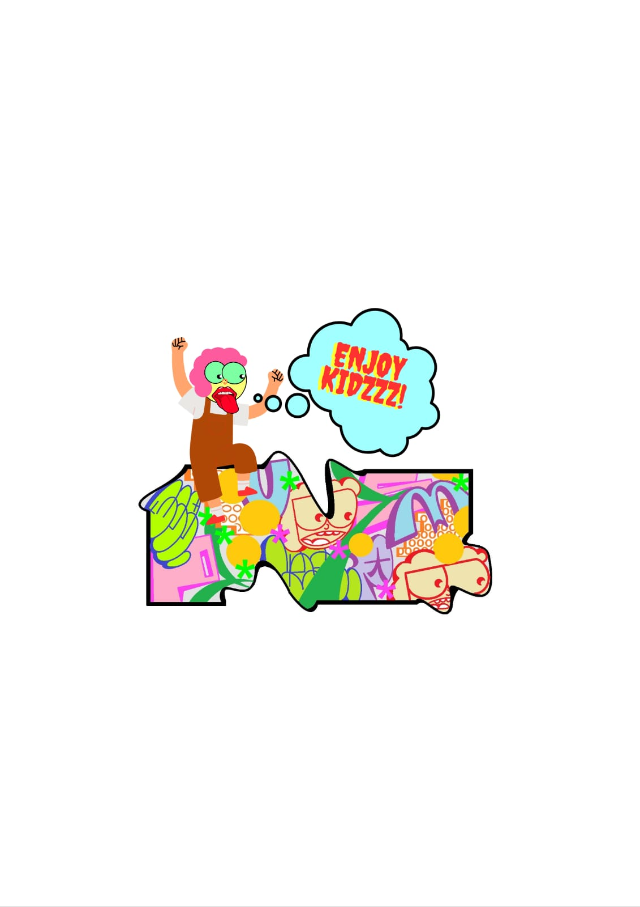
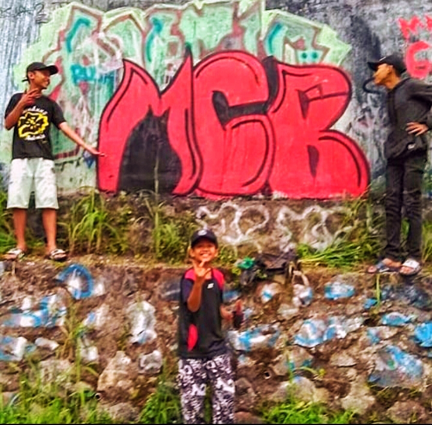

<html>
        
<head>

</head>

<marquee>E N O U G H T O U C H - E N O U G H T O U C H - E N O U G H   T O U C H</marquee>
        
 
 

 
<h1 align="center">E N O U G H  T O U C H</h1>

 
 MPUS  

MPUS menciptakan karakter khas atau alter egonya yang bernama ENJOY KIDZ pada tahun 2019. Ia menunjukkan gaya dan transformasi karakternya yang berulang dengan bereksperimen dan menuangkannya dalam berbagai media seperti kanvas, pakaian, dan lain-lain. Ia mengakui bahwa ada tantangan setiap kali bereksperimen dengan media baru. Seperti melukis di jalanan, melukis di media lain pada ruang yang jauh lebih kecil, dan memiliki suasana,jalanan, seperti mencium aroma jalan, mendengarkan suara mobil yang lewat, dan memacu adrenalin gambar di jalan. Enough Touch merupakan sebuah kumpulan ide & karya bertemakan Graffiti dan Doodle hasil dari karya MPUS.Lalu ia membuat sebuah Merchandise & Clan yang bernama ENOUGH TOUCH.
 

 

<h2> HASIL KARYA </h2>

ENJOY KIDZ

 "Destroy to Create" 2022 

<pre><a href="a1.html" class="logo">artwork information</a></pre>

 

 
  

KIDZ & GANG

 "Destroy to Create" 2017 

<pre><a href="a11.html" class="logo">artwork information</a></pre>

 

 
 
 
&copy; enough.touch

<html>

<head>

<body>

<marquee>E N O U G H T O U C H - E N O U G H T O U C H - E N O U G H   T O U C H</marquee>
 

<table border=4 align="center">

<tr>

<td colspan= 4>
 "Destroy to Create 2022" 
</td>

<tr>
 
<td rowspan = 5> </img></td>
</tr>
  
<tr>
 
<td>1</td>

<td>Name</td>

<td>Enjoy Kidz</td>
</tr>

<tr>
 
<td>2</td>
<td>Information</td>

<td>Digital Pop Art</td>

</tr>

<tr>

<td>3</td>

<td>Production</td>

<td>Pamulang, Indonesia 2022</td>

</tr>

<tr>
<td colspan= 4>
ENOUGH TOUCH
</td>

</tr>

</tr>

</table>
 
 
 Enjoy Kidz  
awal mula terciptanya karya Digital POP ART ini Melainkan belajar sendiri atau secara otodiak. 
 "Sebetulnya Gue mendalami seni mural ini enggak ada yang ngajarin, otodidak aja. Bahkan memang sudah ada bakat menggambar sejak kecil".

 
 
 
 

<pre><a href="a2.html" class="logo"> Hasil Karya </a></pre>

<pre><a href="a.html" class="logo"> BACK </a></pre>

 
 
 
&copy; enough.touch

